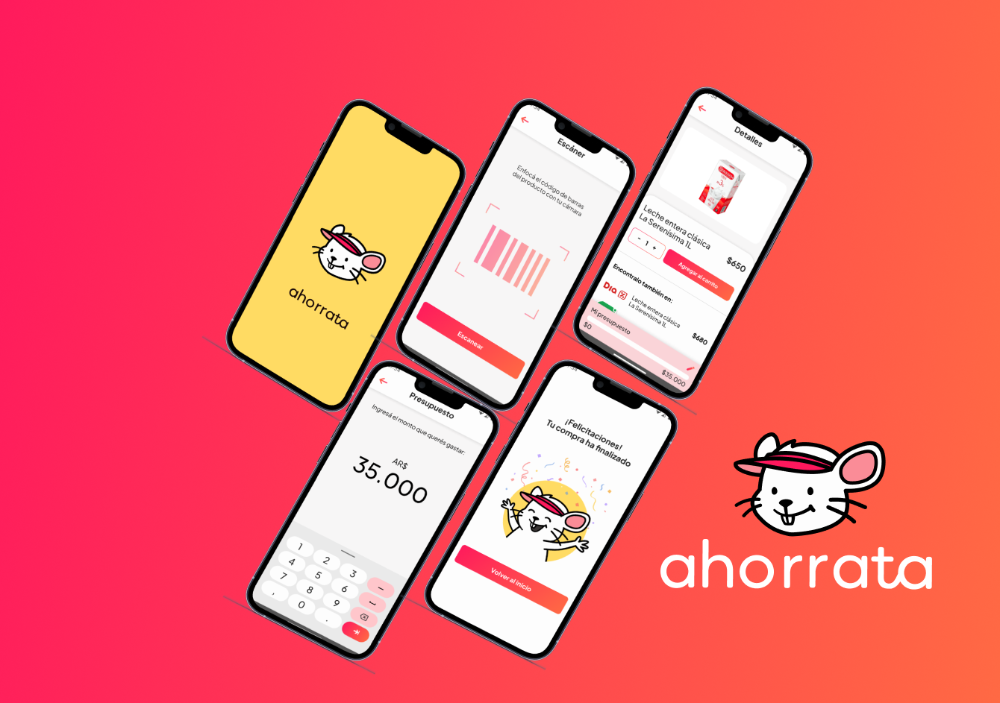

# Hi there! 👋 Welcome to My GitHub!

<!-- ICONOS DE REDES SOCIALES -->

  
  
   
  
  
  
  

I'm **Rocio!**, a passionate web developer constantly exploring new technologies. Here you'll find my projects, code experiments, and some cool stuff I’ve been working on. Let's connect and build something awesome together! 🚀

## 🌟 Courses and Certifications

I am currently enrolled in a course at the MediaPila Foundation and Talento Tech.

  <a href="https://mediapila.org.ar/la-fundacion/" target="_blank" style="text-decoration: none; display: inline-flex; align-items: center;">
    
    MediaPila Course
  </a>

  <a href="https://inscripcionesagencia.bue.edu.ar/talentotech/courses" target="_blank" style="text-decoration: none; display: inline-flex; align-items: center;">
    
    Programación con Python
  </a>

---

## 🛠️ My Tech Stack

I enjoy working with a wide range of technologies! Here’s a glance at the languages and tools I use frequently:

  

## 💻 Projects

|   | Ahorrata |   | LegalHub |   | É-Médica |   |
|---|-----------|---|-----------|---|-----------|---|
|   |  |   |  |   |  |   |
|   | **UX Research UI Designer**   I developed the prototype for Ahorrata, a budgeting app designed to help users save on supermarket shopping. I conducted user research to understand shopping habits and preferences, and created an intuitive UI focused on setting and tracking budgets, making saving easy and efficient.    |   | **UI Designer**   I designed the prototype for LegalHub, an online legal services platform, and handled product organization. I led testing to ensure a smooth and secure user experience, connecting clients with legal experts.    |   | **UX UI Designer**   I developed a prototype for a medical app that provides virtual assistance quickly and securely. The goal was to improve healthcare access by offering consultations without delays, from anywhere..    |   |

---

## 🎨 Hobbies

| Hobby                             | Icon                                                      |
|-----------------------------------|-----------------------------------------------------------|
| ✈️ Designing interfaces           |  |
| 📚 Learning about new technologies |  |
| 📖 Reading personal development books |   |
| 🌍 Traveling and exploring new cultures |   |

---

## 🌱 What I’m Currently Learning

- Advanced **JavaScript** techniques and modern frameworks 🌐
- Backend development with **Node.js** and **Express.js** 🖥️
- Exploring the world of **Docker** and **Kubernetes** for containerization 🐳

---

## 🛠️ Skills

 
 
 
 
 
 
 
 
 
 

## 🌐 Find Me Online 
 

